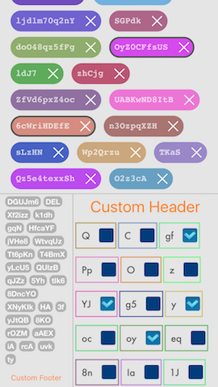
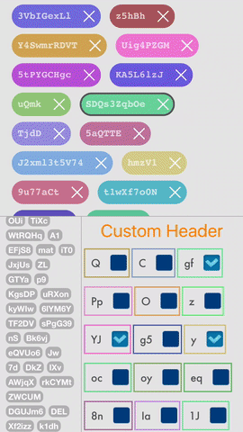

# ORBTagList [](https://opensource.org/licenses/Zlib) 

ORBTagList visually represents data in the form of tag list (cloud). It's highly customizable and uses iOS-friendly protocols for data input and appearance control.

 

## Usage

### Create tag list
```objective-c
/* Required minimum */
ORBTagList *tagList = [[ORBTagList alloc]
                        initWithFrame:self.view.bounds];
tagList.dataSource = self;
tagList.delegate = self;

[self.view addSubview:tagList];
```

### Customize
All properties have default values, so this step is optional.
```objective-c
tagList.tagListHeaderView = [[UIView alloc] initWithFrame:CGRectMake(0, 0,
                                                                      tagList.bounds.size.width,
                                                                      20)];
tagList.tagListFooterView = [[UIView alloc] initWithFrame:anyCustomViewYouWant];
                                                                      
tagList.leftEdgeInset = 20;
tagList.rightEdgeInset = 20;
```

### Refresh
Every time data source or appearance details is changed, you should call this method to force tag list to refresh its layout.
```objective-c
[tagList reloadData];
```

<hr>

### Data Source
Implement `ORBTagListDataSource` protocol to provide tag list with fresh data to show.
`ORBTagListItem` class has a set of customization properties to change its look on the fly.

```objective-c
/* Required methods */

- (NSUInteger)numberOfItemsInTagList:(ORBTagList *)tagList {
    return [self.tagStrings count];
}

- (ORBTagListItem *)tagList:(ORBTagList *)tagList tagItemAtIndex:(NSUInteger)tagItemIndex {
    if (tagList == self.firstTagList) {
        /* Use default class */
  
        ORBTagListItem *tag = [[ORBTagListItem alloc]
                               initWithText:self.tagStrings[tagItemIndex]];
        
        tag.tagFont = [UIFont fontWithName:@"Courier-Bold" size: 17.0f];
        tag.tagNameColor = [UIColor colorWithWhite:1.0f alpha:0.7f];
        tag.tagBackgroundColor = [UIColor darkGrayColor];
        tag.tagCornerRadius = 20;
        tag.horizontalPadding = 10;
        
        tag.accessoryView = ORBTagListItemAccessoryViewRemoveItem;
        
        return tag;
    } else if (tagList == self.secondTagList) {
        /* Or whatever subclass you want */
    
        ORBTagListItemSubclass *tag = [[ORBTagListItemSubclass alloc]
                               initWithText:self.tagStrings[tagItemIndex]];
        
        tag.tagFont = [UIFont fontWithName:@"Futura-Medium" size:16.0f];
        tag.tagNameColor = [UIColor darkGrayColor];
        tag.tagBackgroundColor = self.view.backgroundColor;
        tag.tagCornerRadius = 0;
        tag.horizontalPadding = 12;
        
        tag.accessoryView = ORBTagListItemAccessoryViewCustom;
        
        tag.layer.borderWidth =  2;
        tag.layer.borderColor = [[UIColor orangeColor] CGColor];
        
        UIImageView *accessoryImage = [[UIImageView alloc] initWithImage:yourCustomImage];
        accessoryImage.frame = CGRectMake(0, 0,
                                          28, 28);
        
        tag.customAccessoryView = accessoryImage;
        tag.customAccessoryViewPadding = 5;
        
        return tag;
    }
}

/* Optional methods */

- (CGFloat)heightForAllItemsInTagList:(ORBTagList *)tagList {
    if (tagList == self.firstTagList) {
        return 40;
    } else if (tagList == self.secondTagList) {
        return 20;
    }
}

- (CGFloat)horizontalSpaceBetweenItemsInTagList:(ORBTagList *)tagList {
    if (tagList == self.firstTagList) {
        return 15;
    } else if (tagList == self.secondTagList) {
        return 5;
    }
}

- (CGFloat)verticalSpaceBetweenItemsInTagList:(ORBTagList *)tagList {
    if (tagList == self.firstTagList) {
        return 10;
    } else if (tagList == self.secondTagList) {
        return 5;
    }
}
```

### Delegate
Implement `ORBTagListDelegate` to handle UI events and user feedback.
```objective-c
- (void)tagList:(ORBTagList *)tagList itemTappedAtIndex:(NSUInteger)tagItemIndex {
    NSLog(@"Tapped tag #%lu", (unsigned long)tagItemIndex);
}

- (void)tagList:(ORBTagList *)tagList itemAccessoryButtonTappedAtIndex:(NSUInteger)tagItemIndex {
    NSLog(@"Tapped tag accessory #%lu", (unsigned long)tagItemIndex);
}

- (void)tagList:(ORBTagList *)tagList requestedTagListItemRemovalAtIndex:(NSUInteger)tagItemIndex {
    NSLog(@"Asked to remove tag #%lu", (unsigned long)tagItemIndex);
    
    [self.tagStrings removeObjectAtIndex:tagItemIndex];
    [tagList reloadData];
}
```

## Classes Reference

### `ORBTagList` Class
```objective-c
#pragma mark - Properties

/* DATA CONTROL */

/**
 Reference to object implementing ORBTagListDataSource protocol.
 */
@property (nonatomic, weak) id <ORBTagListDataSource> dataSource;

/**
 Reference to object implementing ORBTagListDelegate protocol.
 */
@property (nonatomic, weak) id <ORBTagListDelegate> delegate;

/* CUSTOMIZATION */

/**
 Custom header view on top of the Tag List.
 */
@property (nonatomic, strong) UIView *tagListHeaderView;

/**
 Custom footer view in the bottom of the Tag List.
 */
@property (nonatomic, strong) UIView *tagListFooterView;

/**
 Left inset of Tag List view.
 */
@property (nonatomic, assign) CGFloat leftEdgeInset;

/**
 Right inset of Tag List view.
 */
@property (nonatomic, assign) CGFloat rightEdgeInset;

#pragma mark - Methods

/**
 \brief Returns necessary Tag Item in List if any.
 \param tagIndex Index of List Item to get.
 \returns ORBTagListItem object at given index.
 */
- (ORBTagListItem *)tagItemAtIndex:(NSUInteger)tagIndex;

/**
 \brief Forces Tag List ro reload its data and layout using DataSource and Delegate protocols.
 */
- (void)reloadData;
```

### `ORBTagListItem` Class
```objective-c
#pragma mark - Properties

/**
 Tag name to display.
 */
@property (nonatomic, strong) NSString *tagName;

/**
 Font to display. Tag Item's size is automatically calculated considering this property.
 */
@property (nonatomic, strong) UIFont *tagFont;

/**
 Color of the text to display.
 */
@property (nonatomic, strong) UIColor *tagNameColor;

/**
 Background color of the tag.
 */
@property (nonatomic, strong) UIColor *tagBackgroundColor;

/**
 Corner radius of the tag's containing view.
 */
@property (nonatomic, assign) CGFloat tagCornerRadius;

/**
 Padding to apply on left and right sides of tag text. Tag Item's size is automatically calculated considering this property.
 */
@property (nonatomic, assign) CGFloat horizontalPadding;

/**
 Type of the accessory view to display. Tag Item's size is automatically calculated considering this property.
 */
@property (nonatomic, assign) ORBTagListItemAccessoryView accessoryView;

/**
 Custom accessory view to display. Tag Item's size is automatically calculated considering this property.
 */
@property (nonatomic, strong) UIView *customAccessoryView;

/**
 Horizontal padding applied to custom accessory view. Tag Item's size is automatically calculated considering this property.
 */
@property (nonatomic, assign) CGFloat customAccessoryViewPadding;

#pragma mark - Methods

/**
 \brief Instantiates new Tag List Item with given text.
 \param text Text to display.
 \returns Tag List Item instance.
 */
- (instancetype)initWithText:(NSString *)text;
```

## ToDo's
+ Optimize memory consumption for massive data;

## License
ORBTagList is released under the permissive zlib License. See the [LICENSE](https://raw.githubusercontent.com/0xNSHuman/ORBTagList/master/LICENSE.md) file.

